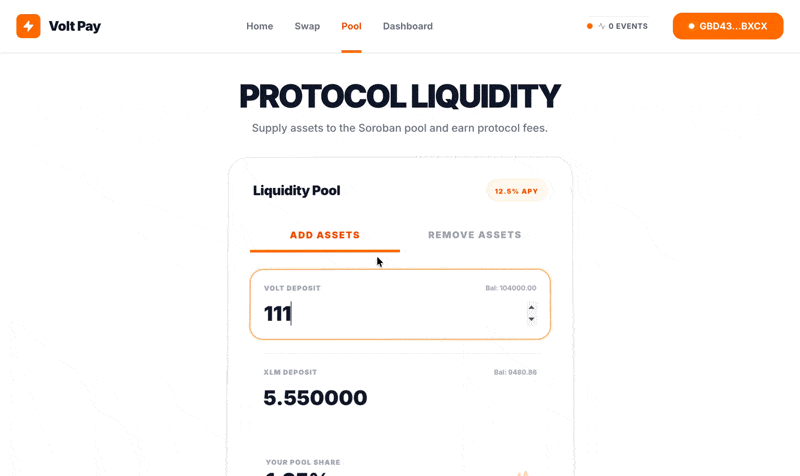

# ⚡️ BitPay

[](https://github.com/yajush404/BITPAY/actions/workflows/ci.yml)

BitPay is a high-performance, decentralized finance (DeFi) platform built on the **Stellar Soroban** smart contract ecosystem. Experience secure, swift, and low-cost payments and asset swaps with a premium, motion-rich interface.

**Live Demo:** [https://bitpay-demo.vercel.app](https://bitpay-demo.vercel.app)

## 🎥 Demo Preview



## 📱 Mobile Responsive View


## ✨ Core Features

### 🏦 Dashboard & Portfolio
Monitor your assets in real-time. View your XLM and native token balances with high-fidelity animated charts and a modern dark-mode aesthetic.


### 🔄 Instant Swaps
Swap between XLM and protocol tokens instantly using our automated market maker (AMM) pools. Powered by Soroban's efficient smart contract execution.


### 💧 Liquidity Pools
Provide liquidity to the protocol and earn a share of every swap fee. Our dynamic APY engine ensures competitive rewards for LPs.


## 📜 Smart Contracts (Testnet)

| Contract | Address |
| :--- | :--- |
| **Liquidity Pool** | `CCQZXG3QGFPLRS6LJJ4XALJGUGVNLISYN6BJSVOH57ED6FYJH7KGKXAR` |
| **Protocol Token** | `CCHLK4RHSS27U4K6VRIP6QW2N5IGBJJES4GA4CI3RRUGP54G4FH5HL7P` |
| **Asset Wrapper** | `CBMGE6BSHIGBXAUMW32D542POCBMI3DHP7ZZGI6RTGPRECJQA3S5ZFDI` |
| **Token Issuer** | `GBALPCSLWTTOVYUJ35KSDBOQETFDFAGKMQOYN76OWLY7QCIHLQUHINBS` |

**Deployment Transaction Hash:** `6bf10b777a1fc6c986eb1626f6345ecb72183c220f8ccda04f5e71415df8cd6a`

## 🛠 Tech Stack

- **Framework**: Next.js 14 (App Router)
- **Styling**: Vanilla CSS + Framer Motion
- **Blockchain**: Stellar Soroban (Rust Contracts)
- **Wallet**: Freighter API (v6+)
- **State Management**: SWR (Real-time Polling)

## 📦 Project Structure

```bash
├── contracts/      # Soroban Smart Contracts (Rust)
├── frontend/       # Next.js Application
├── public/assets/  # Project Screenshots & Branding
├── scripts/        # Deployment & Test Scripts
└── vercel.json     # Vercel Deployment Config
```

## 🔐 Security & Reliability

Built with security as a priority:
- **SAC Integration**: Uses the Soroban Asset Connector for seamless classic Stellar asset integration.
- **Fail-safe Build**: Production-hardened build process with fallback contract ID validation.
- **Type-Safe**: Full TypeScript implementation across the frontend.

---

## 🚀 Getting Started

1. Ensure you have Node.js and npm installed.
2. Navigate to the project directory.
3. Install dependencies:
   ```bash
   npm install
   ```
4. Start the development server:
   ```bash
   npm run dev
   ```

---

Built with ❤️ for the Stellar Community.
